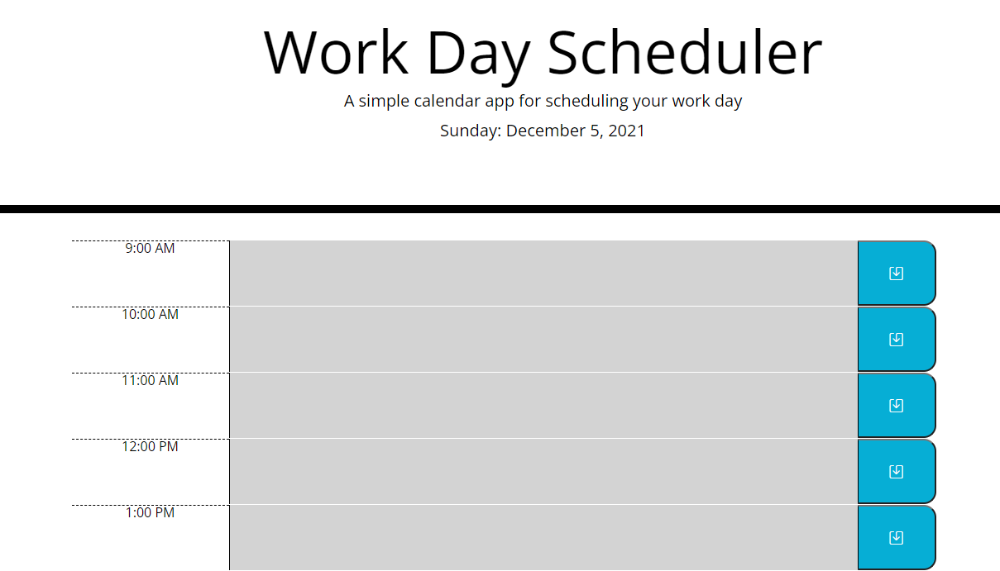

  
# Work Day Scheduler

## Description

This repository contains the code base used in creating the **Work Day Scheduler** application; a single day task schedule app where a user can create and save tasks for a regular 9-5 workday. The app will save tasks into the local storage and will be loaded on a daily basis. When a new day starts, a fresh scheduler will be automatically created. Lastly, when loaded, the background for each time block will change depending on whether it's in the past, present, or future.

## App

The scheduler app can be found here [here](https://nnavarr.github.io/workday-planner/).

## Usage
By clicking into the middle text field, the user can add/edit a task. In order to save the task to the local storage, the user can click the blue save button to the right of the task text area. To clear an existing task, simply remove all text and click save when blank.

When the app is loaded on a new day, the previous day's tasks will be removed and a fresh version will be created. 